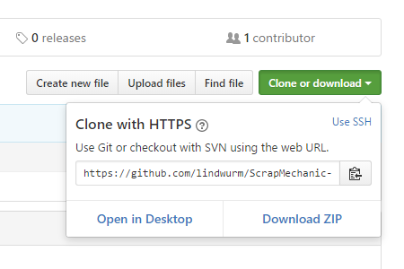

# ScrapMechanic-l10n-jp

## これは何？

- Scrap Mechanicの日本語訳を眺めるやつ
- 気になるところはぼちぼち直したいやつ

## 使い方

- [ScrapMechanic-l10n-jp](https://github.com/lindwurm/ScrapMechanic-l10n-jp) の「Clone or Download」→「Download ZIP」から zip をダウンロード

- zip 内の「Data」フォルダを `C:\Program Files (x86)\Steam\steamapps\common\Scrap Mechanic\Data` (標準のインストール先の場合) に上書き
- Scrap Mechanic を起動、OPTION → DISPLAY → LANGUAGE で「Japanese」を選択

## 戻し方

- ゲームキャッシュの整合性を確認
